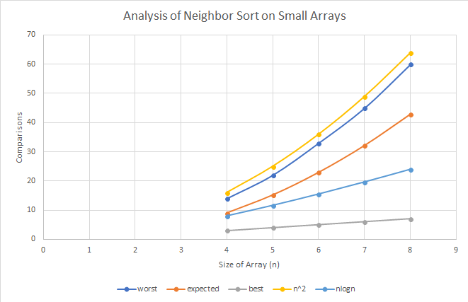

# Neighbor Sort
### Overview of Sorting Algorithm
1. Creates a sub_array of size n-1.
2. Runs through the input array and stores the result of (array\[i\] - array\[i+1\]) into sub_array\[i\].
3. Searches in the sub_array for consecutive positive numbers. 
4. Saving the starting and ending index of the positive numbers, the algorithm then calls the reverse function with the
  input array and the saved indexes. The reverse function flips the part of the array belonging to start and end index inclusive.
5. Once the entire sub_array has been searched, the boolean value, sorted, is checked. If true the array is returned, else the 
  function is recursively called on the array.

### Comparison Analysis
  In SortDiver.java I ran neighborSort(int\[\] array) on arrays of size 10, 100, and 1000. I shuffled the list before each
call to the function and called the function 1000 times per array size. I calculated the average number of comparisons
it took to sort each size array. 
  Outside of the main function, I wrote a function which would create all n^n possible arrays and run neighborSort on each of them.
This time I found the maximum, minimum and average number of comparisons the algorithm would take. I slightly modified the code
and did this for n = 4, 5, 6, 7 and 8. I graphed the data in excel to find the Big-O class. 

### Graph of Runtime of neighborSort()

### Output from SortDriver.java - Run with n = 8 for truthTableArrays()
  Beginning large test.
  n = 10; Average comparisons = 71.636
  n = 100; Average comparisons = 8530.447
  n = 1000; Average comparisons = 933023.178
  End of large test.
  About to run on truthTableArrays()
  Worst comparisons: 60
  Average comparisons: 42.93504756689072
  Best comparisons: 7
